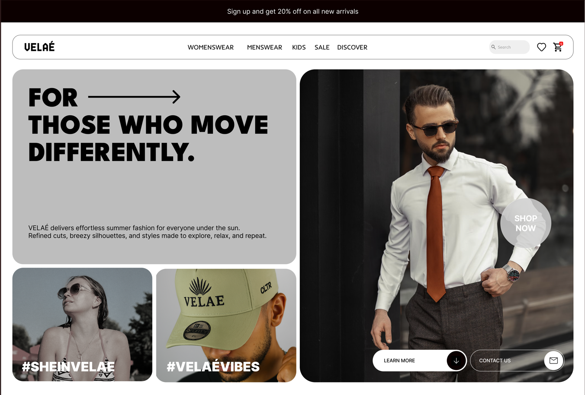
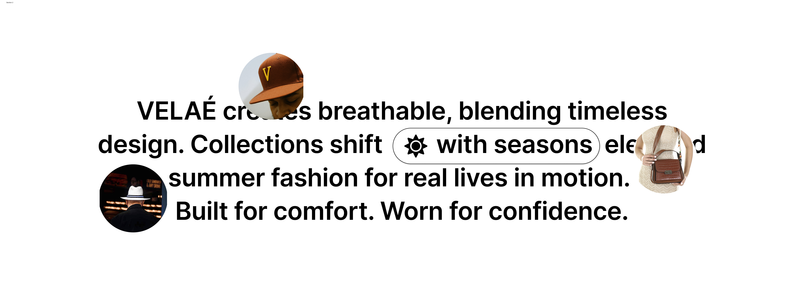

# VELAÉ - Summer eCommerce UI Design ☀️

**VELAÉ** is a conceptual eCommerce UI built in **Figma**, designed for a summer clothing collection for both **men** and **women**.  
The goal: to create a clean, brand-forward shopping experience inspired by lightweight fashion, sustainability, and sun-season vibes.

---

## ✨ Project Highlights

- 🌞 Bold hero with strong identity
- 🧥 Essentials section with clear filtering
- 🎯 Consistent grid and spacing system
- 🔤 Custom font pairing (`Playfair Display` for elegance + `Inter` for clarity)
- ♻️ Sustainable message section
- 🧵 Optional "Design Your Own" CTA for user creativity

---

## 🎨 Design Approach

> “Design is about emotion, not just function.”

From the start, I wanted to convey lightness — not just in fashion but in the **feeling of shopping**. The layout uses space, imagery, and type to create that airy experience while staying structured and product-focused.

---

## 📷 Screenshots

### 💻 Homepage

### 🛍️ Section-2

### 🛍️ Section-3

### 📱 Responsive Snapshots

---

## 🛠️ Tools Used
- Figma (Auto Layout, Components, Color Styles)
- Fonts: [Playfair Display](https://fonts.google.com/specimen/Playfair+Display), [Inter](https://fonts.google.com/specimen/Inter)

---

## 🚀 Live Preview / Prototype
[🔗 Figma Link or Portfolio Live Preview]

---

## 📬 Let’s Connect
Reach out if you'd like to collaborate, give feedback, or discuss UI/UX!